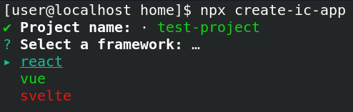
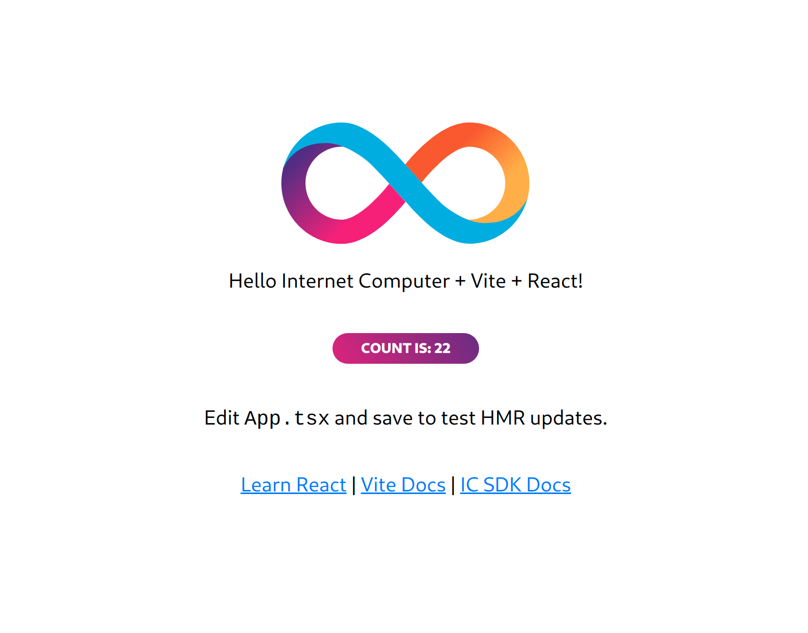
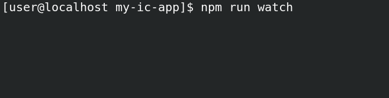

## Getting Started

## Requirements

Install the beta version of the DFINITY Canister SDK

<pre><code>
DFX_VERSION=0.7.0-beta.8 sh -ci "$(curl -fsSL https://sdk.dfinity.org/install.sh)" 
</pre></code>

## Get Started

With NPM:

<pre><code>
npx create-ic-app
</pre></code>

After the setup is done

<pre><code>
cd test-project
npm install
</pre></code>

Start the backend

<pre><code>
dfx start --background
dfx canister create --all
dfx build
dfx canister install --all
</pre></code>

Start the frontend

<pre><code>
npm run dev
</pre></code>

Thats it! The counter demo is persisted on your local Internet Computer.

## [Experimental] Watch mode for canisters
This will auto build and install your canisters whenever you make a change to them

<pre><code>
npm run watch
</pre></code>

## Adding / Removing / Renaming Canisters

You will have to edit 3 files:

* dfx.json
* tsconfig.json
* src/agent.ts

More detailed instructions later. For now see how it's done in those files for the example counter canister.

## Deploying Asset Canister

Run the following commands

<pre><code>
dfx build
dfx canister install --all --mode=reinstall
</pre></code>

Then grab the asset canister ID from the output. Shown here:

Now you can visit the following url in your browser to see it running on your local internet computer:

<code>http://localhost:8000?canisterId=<CopiedCanisterId\></code>

## Community templates / Contributions
Want to contribute your own template? Find something that could be improved? Repo is open for PRs! Happy to assist you in this. You'll receive full credit for your contribution of course.

### Contributions
@ferMartz (React JS + Tailwind template)